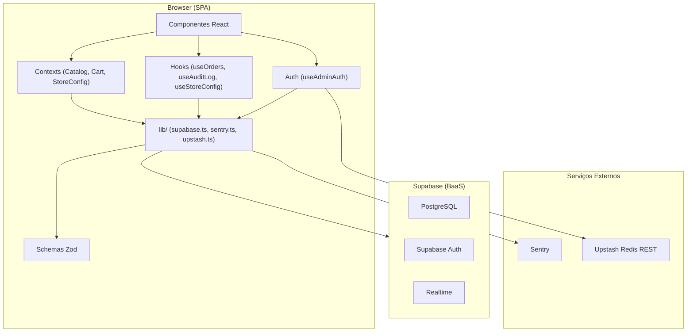
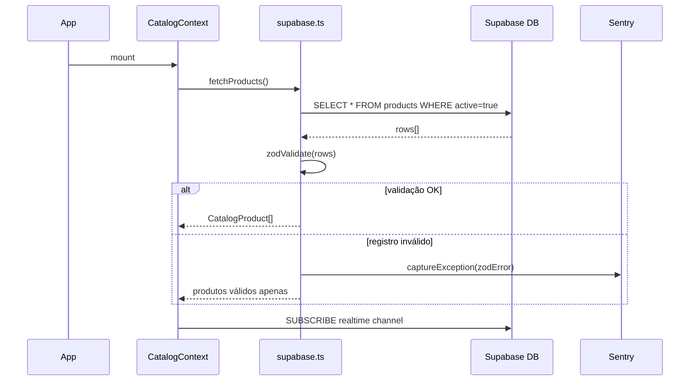
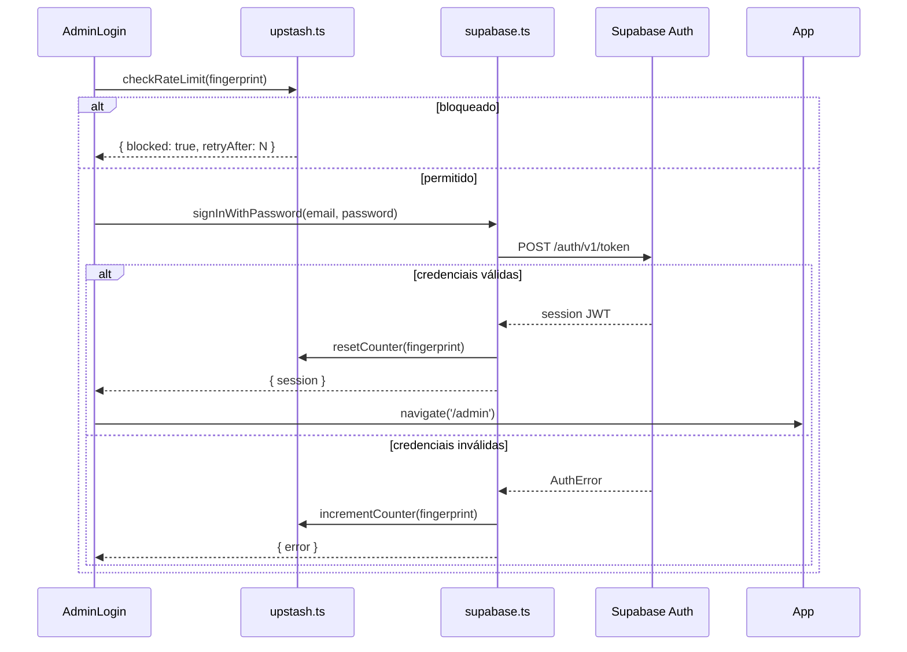

# Design: Backend E-commerce Completo — DH Multiprodutos

## Visão Geral

Este documento descreve a arquitetura técnica para a evolução do backend e da experiência de uso do site DH Multiprodutos. O projeto é uma SPA React 19 + TypeScript + Vite que atualmente usa `localStorage` para persistência. A evolução substitui essa camada por Supabase (PostgreSQL + Auth + Realtime), adiciona rate limiting via Upstash Redis, monitoramento via Sentry, validação com Zod, sanitização com DOMPurify e um novo componente `FlavorPickerModal`.

A stack permanece 100% client-side (SPA). Não há migração para Next.js ou SSR.

### Objetivos Principais

- Persistência real de catálogo, estoque e pedidos no Supabase
- Autenticação segura do administrador via Supabase Auth (substituindo senha hardcoded)
- Modal de seleção de sabor no fluxo de carrinho da HomePage
- Admin Dashboard aprimorado com abas de Pedidos, Estoque e Configurações
- Monitoramento de erros em produção via Sentry
- Rate limiting de login via Upstash Redis
- Validação de dados com Zod e sanitização com DOMPurify

---

## Arquitetura

### Diagrama de Camadas



### Fluxo de Dados Principal



### Fluxo de Autenticação



---

## Componentes e Interfaces

### Novos Arquivos

#### `src/lib/supabase.ts`
Singleton do cliente Supabase. Exporta `supabase` (instância `SupabaseClient`) e funções de acesso ao banco.

```typescript
import { createClient } from '@supabase/supabase-js'

const url = import.meta.env.VITE_SUPABASE_URL
const key = import.meta.env.VITE_SUPABASE_ANON_KEY

export const supabase = createClient(url, key)
```

#### `src/lib/sentry.ts`
Inicialização do Sentry. Chamado em `main.tsx` antes de `ReactDOM.createRoot`.

```typescript
import * as Sentry from '@sentry/react'

export function initSentry() {
  const dsn = import.meta.env.VITE_SENTRY_DSN
  if (!dsn) return
  Sentry.init({ dsn, tracesSampleRate: 0.2 })
}
```

#### `src/lib/upstash.ts`
Cliente Upstash Redis REST para rate limiting. Usa fetch nativo (sem SDK) para manter o bundle pequeno.

```typescript
// Interface pública
export async function checkRateLimit(key: string): Promise<{ blocked: boolean; retryAfter?: number }>
export async function incrementAttempt(key: string): Promise<number>
export async function resetAttempts(key: string): Promise<void>
```

#### `src/schemas/product.schema.ts`
Schemas Zod para `CatalogProduct` e `ProductFlavor`. Os tipos TypeScript são inferidos dos schemas.

```typescript
export const ProductFlavorSchema = z.object({ ... })
export const CatalogProductSchema = z.object({ ... })
export type ProductFlavor = z.infer<typeof ProductFlavorSchema>
export type CatalogProduct = z.infer<typeof CatalogProductSchema>
```

#### `src/schemas/order.schema.ts`
Schema Zod para `Order`.

#### `src/schemas/config.schema.ts`
Schema Zod para `StoreConfig`.

#### `src/auth/useAdminAuth.ts`
Hook que encapsula `supabase.auth.getSession()` e `onAuthStateChange`. Substitui `adminSession.ts`.

```typescript
export function useAdminAuth(): {
  session: Session | null
  loading: boolean
  signIn: (email: string, password: string) => Promise<AuthError | null>
  signOut: () => Promise<void>
}
```

#### `src/context/StoreConfigContext.tsx`
Context que carrega e persiste configurações da tabela `store_config`.

```typescript
export function useStoreConfig(): {
  config: StoreConfig
  updateConfig: (patch: Partial<StoreConfig>) => Promise<void>
  loading: boolean
}
```

#### `src/components/FlavorPickerModal.tsx`
Modal de seleção de sabor exibido ao clicar "Adicionar ao carrinho" no `ProductTile`.

```typescript
interface FlavorPickerModalProps {
  product: CatalogProduct
  onClose: () => void
  onAdd: (flavorId: string, flavorName: string) => void
}
```

**Comportamento:**
- Pré-seleciona automaticamente se houver exatamente 1 sabor com `stock > 0`
- Chips de sabor: disponível (clicável), esgotado (disabled + label "Esgotado")
- Botão confirmar: chama `onAdd(selectedFlavorId, flavorName)` e fecha
- Confirmar sem seleção: exibe "Escolha um sabor para continuar." inline
- Overlay clicável e botão "×" fecham sem adicionar ao carrinho

#### `src/hooks/useOrders.ts`
Hook para CRUD de pedidos na tabela `orders`.

```typescript
export function useOrders(): {
  orders: Order[]
  loading: boolean
  saveOrder: (order: Omit<Order, 'id' | 'created_at'>) => Promise<void>
  updateStatus: (id: string, status: OrderStatus) => Promise<void>
}
```

#### `src/hooks/useAuditLog.ts`
Hook para inserção e leitura do `audit_log`.

```typescript
export function useAuditLog(): {
  logs: AuditLogEntry[]
  loading: boolean
  logAction: (entry: Omit<AuditLogEntry, 'id' | 'created_at'>) => Promise<void>
}
```

#### `src/hooks/useStoreConfig.ts`
Hook para leitura e atualização de `store_config`.

### Arquivos Modificados

#### `src/auth/adminSession.ts`
Mantido apenas como re-export de compatibilidade durante a migração. A lógica real migra para `useAdminAuth.ts`.

#### `src/context/CatalogContext.tsx`
- Fonte primária: tabela `products` do Supabase
- Fallback: `localStorage` se Supabase falhar
- Subscrição Realtime para sincronização entre abas
- Validação Zod em cada registro recebido
- Soft delete em `removeProduct` (seta `active = false`)

#### `src/pages/AdminLogin.tsx`
- Campos: e-mail + senha (em vez de só senha)
- Verifica rate limit antes de chamar Supabase Auth
- Exibe mensagem de bloqueio com tempo restante
- Sem fallback de senha local quando `VITE_SUPABASE_URL` está configurado

#### `src/pages/AdminDashboard.tsx`
- Abas: Produtos | Pedidos | Estoque | Configurações
- Aba Pedidos: lista com filtro por status, detalhes ao clicar
- Aba Estoque: lista de SKUs com indicadores visuais
- Aba Configurações: formulário de `store_config` + log de auditoria
- Notificações inline (sem `alert()`)
- Navegação por abas fixas na parte inferior em mobile (< 600px)

#### `src/App.tsx`
- `AdminGate` usa `useAdminAuth` em vez de `isAdminSession`
- Adiciona `StoreConfigProvider` ao wrapper de providers
- Inicializa Sentry via `initSentry()` antes do render

#### `src/components/catalog/ProductTile.tsx`
- Botão "Adicionar ao carrinho" abre `FlavorPickerModal` em vez de navegar direto

#### `src/pages/HomePage.tsx`
- Link "Área do lojista" removido — o painel admin é acessível apenas via URL direta `/admin/login`
- Import de `Link` do react-router-dom removido junto com o bloco `.home__admin-link-wrap`

#### `src/pages/AdminLogin.tsx`
- Título alterado para "Painel DH" (sem referência pública ao painel de gestão)

---

## Modelos de Dados

### Tabela `products`

| Coluna | Tipo | Notas |
|---|---|---|
| `id` | `uuid` | PK, default `gen_random_uuid()` |
| `brand` | `text` | não nulo |
| `product_kind` | `text` | ex.: "POD" |
| `name` | `text` | não nulo |
| `puffs` | `text` | ex.: "8.000 puffs" |
| `nicotine` | `text` | ex.: "50mg" |
| `short_description` | `text` | |
| `price` | `numeric(10,2)` | não nulo |
| `compare_at` | `numeric(10,2)` | nullable |
| `image` | `text` | URL https:// |
| `active` | `boolean` | default `true`; soft delete |
| `created_at` | `timestamptz` | default `now()` |
| `updated_at` | `timestamptz` | atualizado via trigger |

### Tabela `flavors`

| Coluna | Tipo | Notas |
|---|---|---|
| `id` | `uuid` | PK |
| `product_id` | `uuid` | FK → `products.id` ON DELETE CASCADE |
| `name` | `text` | não nulo |
| `stock` | `integer` | não nulo, CHECK `stock >= 0` |
| `created_at` | `timestamptz` | default `now()` |
| `updated_at` | `timestamptz` | atualizado via trigger |

### Tabela `orders`

| Coluna | Tipo | Notas |
|---|---|---|
| `id` | `uuid` | PK |
| `created_at` | `timestamptz` | default `now()` |
| `items` | `jsonb` | array de `OrderItem` |
| `total` | `numeric(10,2)` | não nulo |
| `address` | `text` | |
| `payment_method` | `text` | pix / credito / debito / dinheiro |
| `status` | `text` | pending / confirmed / delivered |

### Tabela `store_config`

| Coluna | Tipo | Notas |
|---|---|---|
| `id` | `uuid` | PK |
| `key` | `text` | único, ex.: "whatsapp", "hero_claim" |
| `value` | `text` | valor da configuração |
| `updated_at` | `timestamptz` | atualizado via trigger |

### Tabela `audit_log`

| Coluna | Tipo | Notas |
|---|---|---|
| `id` | `uuid` | PK |
| `created_at` | `timestamptz` | default `now()` |
| `action` | `text` | ex.: "product.update" |
| `admin_id` | `uuid` | FK → `auth.users.id` |
| `entity_type` | `text` | "product" / "flavor" / "order" / "config" |
| `entity_id` | `uuid` | ID do registro afetado |
| `previous_data` | `jsonb` | estado anterior |
| `new_data` | `jsonb` | estado novo |

### Schemas Zod (TypeScript)

```typescript
// src/schemas/product.schema.ts
export const ProductFlavorSchema = z.object({
  id: z.string().uuid(),
  name: z.string().min(1),
  stock: z.number().int().min(0),
})

export const CatalogProductSchema = z.object({
  id: z.string().uuid(),
  brand: z.string().min(1),
  productKind: z.string().min(1),
  name: z.string().min(1),
  puffs: z.string().min(1),
  nicotine: z.string().min(1),
  shortDescription: z.string().default(''),
  price: z.number().min(0),
  compareAt: z.number().min(0).optional(),
  image: z.string().url().startsWith('https://'),
  active: z.boolean().default(true),
  flavors: z.array(ProductFlavorSchema).min(1),
})

export type ProductFlavor = z.infer<typeof ProductFlavorSchema>
export type CatalogProduct = z.infer<typeof CatalogProductSchema>
```

```typescript
// src/schemas/order.schema.ts
export const OrderItemSchema = z.object({
  productId: z.string().uuid(),
  flavorId: z.string().uuid(),
  flavorName: z.string(),
  productName: z.string(),
  brand: z.string(),
  unitPrice: z.number().min(0),
  qty: z.number().int().min(1),
})

export const OrderSchema = z.object({
  id: z.string().uuid(),
  created_at: z.string().datetime(),
  items: z.array(OrderItemSchema).min(1),
  total: z.number().min(0),
  address: z.string(),
  payment_method: z.enum(['pix', 'credito', 'debito', 'dinheiro']),
  status: z.enum(['pending', 'confirmed', 'delivered']),
})

export type Order = z.infer<typeof OrderSchema>
export type OrderItem = z.infer<typeof OrderItemSchema>
export type OrderStatus = Order['status']
```

```typescript
// src/schemas/config.schema.ts
export const StoreConfigSchema = z.object({
  name: z.string().min(1),
  whatsapp: z.string().regex(/^\d{10,15}$/),
  heroClaim: z.string(),
  heroLead: z.string(),
  deliveryLine: z.string(),
  instagram: z.string(),
})

export type StoreConfig = z.infer<typeof StoreConfigSchema>
```

### Row Level Security (RLS)

| Tabela | Anon (público) | Authenticated (admin) |
|---|---|---|
| `products` | SELECT (active=true) | SELECT, INSERT, UPDATE, DELETE |
| `flavors` | SELECT | SELECT, INSERT, UPDATE, DELETE |
| `orders` | INSERT | SELECT, UPDATE |
| `store_config` | SELECT | SELECT, INSERT, UPDATE |
| `audit_log` | — | SELECT, INSERT |

---

## Propriedades de Correção

*Uma propriedade é uma característica ou comportamento que deve ser verdadeiro em todas as execuções válidas de um sistema — essencialmente, uma declaração formal sobre o que o sistema deve fazer. As propriedades servem como ponte entre especificações legíveis por humanos e garantias de correção verificáveis por máquina.*

### Propriedade 1: Validação Zod filtra registros inválidos

*Para qualquer* lista de registros recebidos do Supabase contendo uma mistura de registros válidos e inválidos segundo o schema Zod correspondente, apenas os registros válidos devem ser inseridos no estado da aplicação, e os inválidos devem ser descartados sem interromper o processamento dos demais.

**Valida: Requisitos 1.3, 1.4, 13.2, 13.3**

---

### Propriedade 2: Estoque nunca negativo

*Para qualquer* sabor (`ProductFlavor`) e qualquer sequência de operações de ajuste de estoque (decrementos, incrementos, atribuições diretas), o valor de `stock` deve ser sempre `>= 0` após cada operação.

**Valida: Requisito 2.5**

---

### Propriedade 3: Soft delete preserva registro

*Para qualquer* produto no catálogo, após a operação de remoção (`removeProduct`), o registro deve existir na tabela `products` com `active = false`, e não deve aparecer nas consultas públicas que filtram por `active = true`.

**Valida: Requisito 1.7**

---

### Propriedade 4: Chips de sabor refletem disponibilidade

*Para qualquer* produto com sabores de stocks variados, no `FlavorPickerModal` e nos chips da `ProductPage`, cada sabor com `stock === 0` deve estar desabilitado para seleção, e cada sabor com `stock > 0` deve estar habilitado.

**Valida: Requisitos 2.3, 5.2**

---

### Propriedade 5: Pré-seleção automática com sabor único

*Para qualquer* produto que tenha exatamente um sabor com `stock > 0`, ao abrir o `FlavorPickerModal`, esse sabor deve estar pré-selecionado automaticamente.

**Valida: Requisito 5.8**

---

### Propriedade 6: Objeto de pedido contém todos os campos obrigatórios

*Para qualquer* conjunto de linhas de carrinho (`CartLine[]`) com pelo menos um item, o objeto `Order` construído antes de ser salvo no Supabase deve conter todos os campos obrigatórios (`id`, `created_at`, `items`, `total`, `address`, `payment_method`, `status`) com os tipos corretos conforme o `OrderSchema` Zod.

**Valida: Requisito 4.2**

---

### Propriedade 7: Pedidos ordenados do mais recente para o mais antigo

*Para qualquer* lista de pedidos retornada do Supabase, após a ordenação aplicada pelo hook `useOrders`, a lista deve estar em ordem decrescente de `created_at` (pedido mais recente primeiro).

**Valida: Requisito 4.3**

---

### Propriedade 8: Rate limiting bloqueia após 5 tentativas

*Para qualquer* sequência de N tentativas de login falhas com N >= 5 dentro de uma janela de 15 minutos para o mesmo identificador de cliente, a partir da 5ª tentativa o sistema deve retornar `{ blocked: true }` e exibir a mensagem de bloqueio com o tempo restante.

**Valida: Requisito 12.3**

---

### Propriedade 9: Sanitização remove tags HTML

*Para qualquer* string de entrada contendo tags HTML (incluindo scripts, iframes, event handlers), após a sanitização com DOMPurify, o valor resultante não deve conter nenhuma tag HTML ou atributo de evento JavaScript.

**Valida: Requisito 14.1**

---

### Propriedade 10: Validação de URL de imagem aceita apenas domínios permitidos

*Para qualquer* URL de imagem informada pelo administrador, a validação deve aceitar apenas URLs que começam com `https://` e cujo hostname pertence à lista de domínios permitidos (`unsplash.com`, `images.unsplash.com`, `imgur.com`, `i.imgur.com`), rejeitando todas as demais.

**Valida: Requisito 14.2**

---

### Propriedade 11: Registro de audit log contém todos os campos obrigatórios

*Para qualquer* ação administrativa auditável (criação, edição, exclusão de produto; alteração de estoque; alteração de configurações; login; logout), o objeto inserido na tabela `audit_log` deve conter todos os campos obrigatórios (`action`, `admin_id`, `entity_type`, `entity_id`, `previous_data`, `new_data`) com os tipos corretos.

**Valida: Requisito 15.2**

---

### Propriedade 12: Validação de formulário Zod aceita apenas entradas válidas

*Para qualquer* entrada de formulário de produto ou configuração da loja, a validação Zod deve aceitar entradas que satisfazem todos os constraints do schema e rejeitar entradas que violam qualquer constraint (campo obrigatório vazio, tipo incorreto, valor fora do range).

**Valida: Requisitos 13.4, 13.5**

---

## Tratamento de Erros

### Estratégia Geral

Todos os erros são tratados em três camadas:

1. **Silencioso com fallback**: operações não críticas (audit log, Sentry) falham silenciosamente sem interromper o fluxo principal
2. **Fallback com aviso**: operações críticas de leitura (carregar catálogo) usam `localStorage` como fallback e exibem aviso discreto
3. **Erro inline**: operações de escrita do usuário (salvar produto, configurações) exibem mensagem de erro inline no formulário

### Tabela de Erros por Operação

| Operação | Erro | Comportamento |
|---|---|---|
| Carregar catálogo (Supabase indisponível) | `PostgrestError` | Fallback para `localStorage`; aviso no console e para admin |
| Validação Zod de registro do Supabase | `ZodError` | Descarta registro; `Sentry.captureException` |
| Salvar produto no Supabase | `PostgrestError` | Mensagem inline no formulário; `Sentry.captureException` |
| Registrar pedido no Supabase | `PostgrestError` | Log no console; WhatsApp abre normalmente |
| Inserir no audit_log | `PostgrestError` | `Sentry.captureMessage` (warning); operação principal continua |
| Login com credenciais inválidas | `AuthError` | Mensagem "E-mail ou senha incorretos." |
| Login bloqueado por rate limit | Rate limit atingido | Mensagem "Muitas tentativas. Tente novamente em X minutos." |
| Upstash indisponível | `fetch` error | Login permitido sem rate limiting; aviso no console |
| Sentry DSN ausente | — | Aplicação funciona normalmente; erros apenas no console |
| `VITE_SUPABASE_URL` ausente | — | Painel bloqueado; mensagem de configuração ausente |

### Variáveis de Ambiente

```
# Obrigatórias para produção
VITE_SUPABASE_URL=https://xxx.supabase.co
VITE_SUPABASE_ANON_KEY=eyJ...

# Opcionais (degradação graciosa se ausentes)
VITE_SENTRY_DSN=https://xxx@sentry.io/yyy
VITE_UPSTASH_REDIS_REST_URL=https://xxx.upstash.io
VITE_UPSTASH_REDIS_REST_TOKEN=AXxx...
VITE_WHATSAPP=5538999845134
```

---

## Estratégia de Testes

### Abordagem Dual

A estratégia combina testes baseados em exemplos (para comportamentos específicos e casos de borda) com testes baseados em propriedades (para invariantes universais). Os testes de propriedade usam a biblioteca **fast-check** (TypeScript/JavaScript), configurada com mínimo de 100 iterações por propriedade.

### Testes de Propriedade (fast-check)

Cada propriedade do documento deve ser implementada como um teste fast-check. Configuração mínima:

```typescript
import fc from 'fast-check'

// Tag format: Feature: backend-ecommerce-completo, Property N: <texto>
it('Propriedade 2: Estoque nunca negativo', () => {
  fc.assert(
    fc.property(
      fc.integer({ min: 0, max: 100 }),  // stock inicial
      fc.array(fc.integer({ min: -50, max: 50 })),  // deltas
      (initialStock, deltas) => {
        let stock = initialStock
        for (const delta of deltas) {
          stock = Math.max(0, stock + delta)
          expect(stock).toBeGreaterThanOrEqual(0)
        }
      }
    ),
    { numRuns: 100 }
  )
})
```

**Propriedades a implementar com fast-check:**

| Propriedade | Geradores fast-check |
|---|---|
| P1: Validação Zod filtra inválidos | `fc.array(fc.oneof(validProduct, invalidProduct))` |
| P2: Estoque nunca negativo | `fc.integer({ min: 0 })`, `fc.array(fc.integer())` |
| P3: Soft delete preserva registro | `fc.record({ id: fc.uuid(), ... })` |
| P4: Chips refletem disponibilidade | `fc.array(fc.record({ stock: fc.nat() }))` |
| P5: Pré-seleção com sabor único | `fc.record` com exatamente 1 sabor com stock > 0 |
| P6: Objeto de pedido completo | `fc.array(cartLineArbitrary, { minLength: 1 })` |
| P7: Pedidos ordenados | `fc.array(fc.record({ created_at: fc.date() }))` |
| P8: Rate limit após 5 tentativas | `fc.integer({ min: 5, max: 20 })` (N tentativas) |
| P9: Sanitização remove HTML | `fc.string()` com injeção de tags HTML |
| P10: Validação de URL de imagem | `fc.webUrl()` e URLs inválidas |
| P11: Audit log completo | `fc.constantFrom(...adminActions)` |
| P12: Validação Zod de formulário | `fc.oneof(validForm, invalidForm)` |

### Testes de Exemplo (Vitest + Testing Library)

Focados em comportamentos específicos de UI e fluxos de integração:

- `FlavorPickerModal`: abre ao clicar, fecha ao clicar fora, exibe mensagem sem seleção, toast após adicionar
- `AdminLogin`: redirecionamento após login bem-sucedido, mensagem de erro para credenciais inválidas
- `CatalogContext`: fallback para localStorage quando Supabase falha
- `useOrders`: pedido salvo mesmo quando Supabase falha (WhatsApp abre)
- `useAuditLog`: operação principal não é bloqueada por falha no audit log

### Testes de Integração

Executados contra um projeto Supabase de staging:

- RLS: usuário anon não consegue escrever em `products`
- RLS: usuário anon consegue inserir em `orders`
- RLS: usuário anon não consegue ler `audit_log`
- Realtime: mudança em `products` é propagada para subscribers

### Testes de Fumaça (Smoke Tests)

Verificações de configuração executadas uma vez:

- Variáveis de ambiente `VITE_SUPABASE_URL` e `VITE_SUPABASE_ANON_KEY` presentes no build
- Meta tag CSP presente no `index.html`
- Schemas Zod exportados para todas as entidades
- Bundle de produção não contém strings de senhas ou tokens privados

### Configuração fast-check

```typescript
// vitest.config.ts
export default defineConfig({
  test: {
    globals: true,
    environment: 'jsdom',
  }
})

// Em cada teste de propriedade:
fc.assert(property(...), { numRuns: 100, seed: 42 })
// seed fixo para reprodutibilidade em CI; remover para exploração local
```
